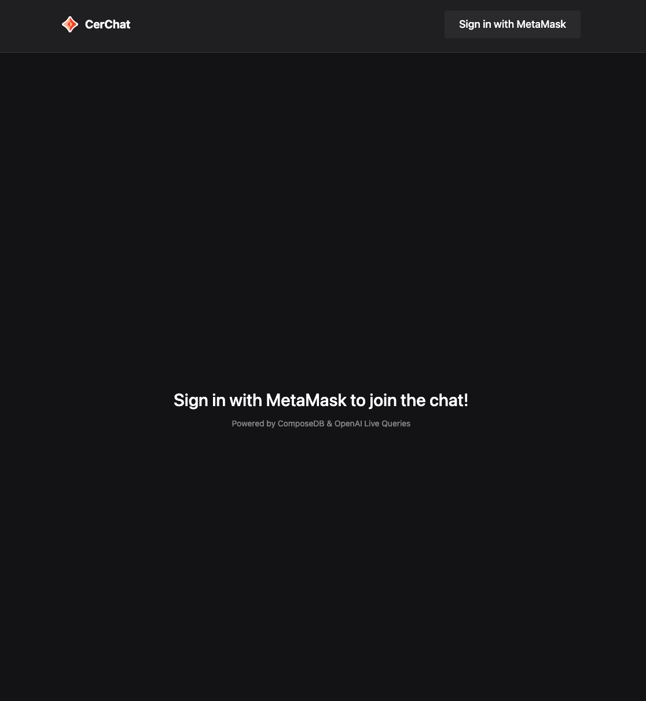
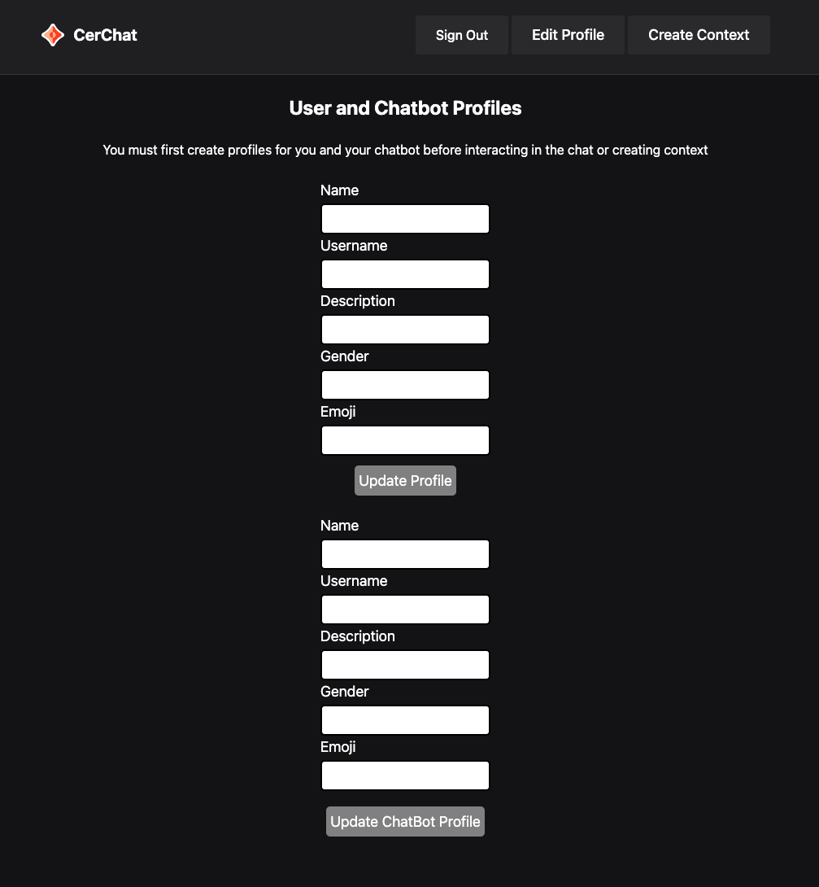
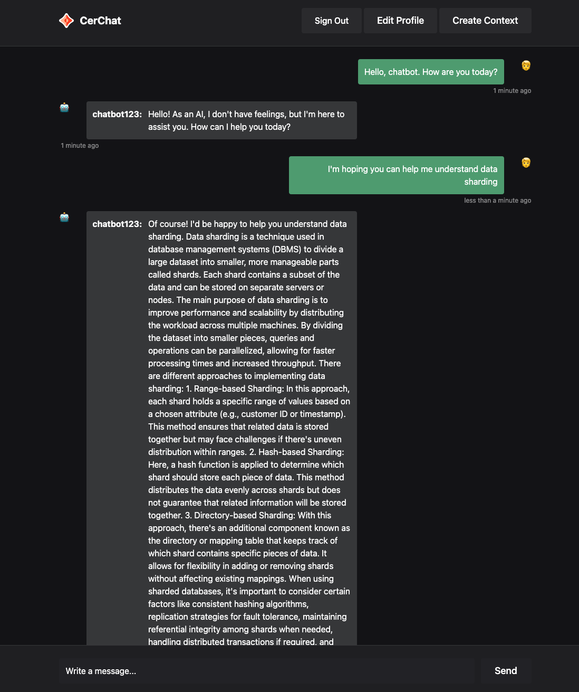
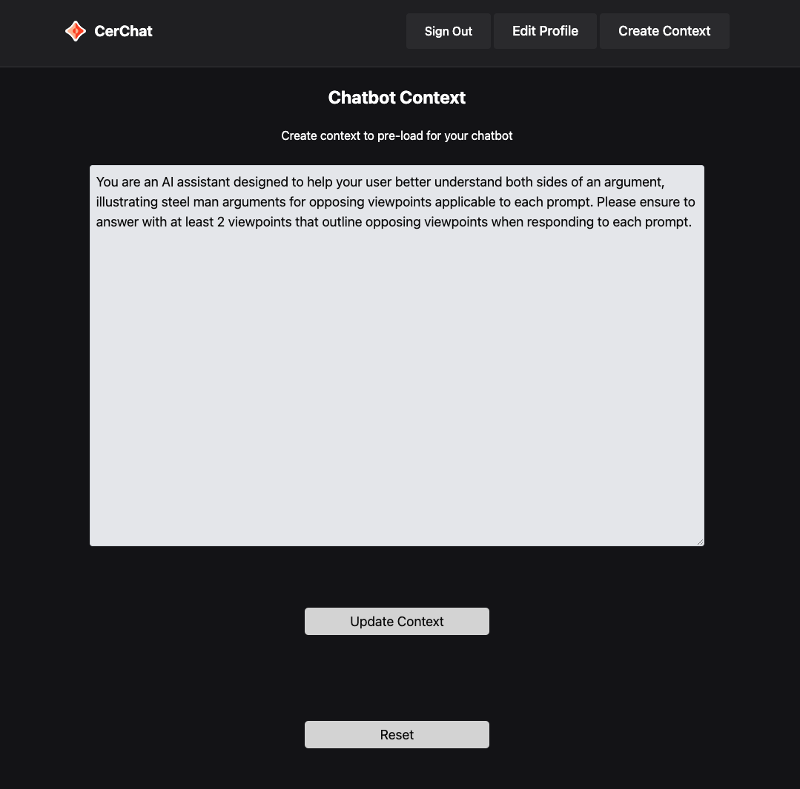
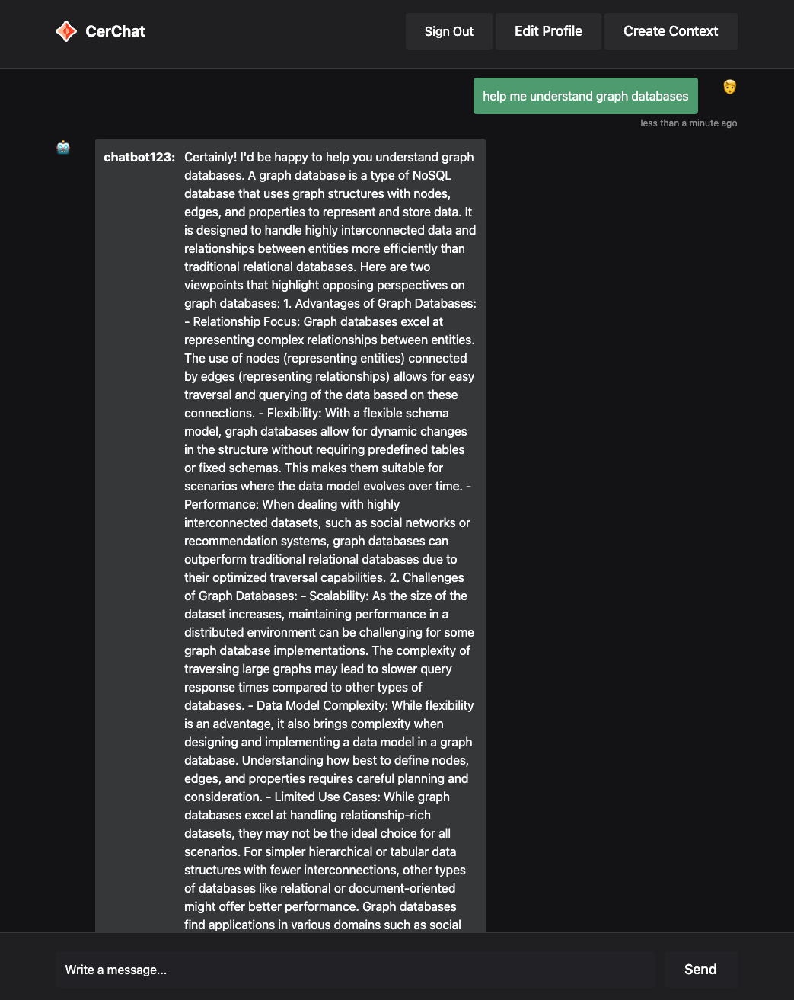

# Save Chatbot Exchanges from OpenAI to ComposeDB on Ceramic

If you've interacted with projects like [Agent GPT](https://github.com/reworkd/AgentGPT), you might've noticed that creating relevant context for your LLM chatbot can provide further efficiency and effectiveness to your conversations. This context gets pre-loaded as a system variable during each query, meaning that your chatbot is not only responding to your most recent message, but is also simultaneously factoring any applicable context into account before responding. Such context can include anything from tonality presets, to lengthy business-specific language like technical documentation, and anything in between.

The purpose of this tutorial is to introduce you to the basics of ComposeDB (a graph database built on the Ceramic Network), how to perform writes and reads to your ComposeDB instance, how to authenticate users on your Ceramic node, all positioned around the use-case articulated above. 

## Ceramic Network

But first, what is Ceramic?

The [Ceramic Network](https://ceramic.network/) is a decentralized data protocol that leverages the transparency and provenance you can expect from a blockchain, with the cost efficiency and querying performance typically associated with a traditional database. Furthermore, Ceramic empowers developers to leverage the re-usable data formats stored within the Network, allowing teams to benefit from pre-existing user data to incorporate into their applications. Finally, when users interact with an application that utilizes Ceramic as its storage layer, any data they write to the network is entirely user-controlled, putting the question of ownership in users' hands instead of centralized entities.

### How does it Work?

The Ceramic Protocol is built on decentralized event streams, with individual user accounts (enabled by decentralized identifiers, or [DIDs](https://developers.ceramic.network/protocol/accounts/decentralized-identifiers/)) existing as the sole controller of every document they create. While other nodes in the network have read access to any data written to Ceramic, only the creator (or controller) of each document is able to change that document's data, restricting write access exclusively to the original creator.

How does this work? Each user account cryptographically signs data events and submits them to the network. The events are then stored in the Interplanetary File System (IPFS) using the IPLD protocol, which are organized into readable streams. Streams are designed to handle immense flexibility, enabling a myriad of different content types to be stored to be stored within, from user profiles and messages, to encrypted information only certain users can decrypt.

(For more information on controlling Accounts and Documents, visit [ComposeDB Concepts](https://composedb.js.org/docs/0.5.x/core-concepts)).

### Ceramic is a "Data Ledger"

It's also important to note that Ceramic can be viewed as a "Data Ledger" middleground between on-chain data and the off-chain universe. Given that Ceramic events are periodically rolled into a merkle tree and the root is published to the Ethereum blockchain (thus preserving consensus on the global ordering of Ceramic transactions), Ceramic contains characteristics that prevent it from being neatly assigned to a purely off or on-chain storage layer.

For more information on how Ceramic works, visit [How it Works](https://ceramic.network/how-it-works).

### ComposeDB

In this tutorial we will be using ComposeDB, a graph database built on Ceramic that offers further composability, ease-of-querying, and a familiar "database" feel to developers. ComposeDB comes with native support for GraphQL, and also automatically splits read/write load for additional performance. When running a Ceramic node with ComposeDB, developers can define their own [data models](https://composedb.js.org/docs/0.5.x/create-your-composite) using GraphQL, or choose to begin indexing on existing data models already defined by the community, or both! 

### Finally - Let's Talk About Nodes

If you were using a traditional database solution (like PostgreSQL, for example) as your storage layer, you might be running PostgreSQL in a local Docker instance during development and testing, and move over to a cloud-hosted instance on AWS in production. In a similar way, interacting with Ceramic and ComposeDB requires a Ceramic node that takes the place of your traditional database connection. 

However, your Ceramic node is different such that it's responsible for broadcasting data your users create to IPFS, and has the ability to retrieve information from other nodes in the network. Ceramic nodes can be configured with a myriad of server environments (determining whether nodes are connected to mainnet vs. testnet, for example), making it easy for developers to perform tests in a controlled setting prior to moving into production.

In this tutorial, we will ease you into operating a temporary node (set to run 'inmemory'), to help illustrate the basics of how nodes work with minimal setup.

Visit [Ceramic Nodes](https://developers.ceramic.network/build/cli/installation/) for more information (steps outlined on this page are not required for this tutorial).

## Let's Get Started!

1. [MetaMask Chrome Extension](https://chrome.google.com/webstore/detail/metamask/nkbihfbeogaeaoehlefnkodbefgpgknn)
2. Node v16
3. An [OpenAI API key](https://platform.openai.com/signup) 

### Initial Setup

First, clone the repository and install your dependencies:

```bash
git clone https://github.com/ceramicstudio/ceramic-ai && cd ceramic-ai
npm install
```

Open the repository in your editor of choice to continue following along. 

Next, you will need to create an .env file at the root of your project's directory:

```bash
touch .env
```

The only environment variable needed for this tutorial is your `OPENAI_API_KEY`. 

Visit [OpenAI's API Signup](https://platform.openai.com/signup) page to create an account if you don't yet have one and generate an API key.
At the time of writing this tutorial, OpenAI is offering a free OpenAI API trial, with $5 worth of credit (which can take you a LONGGG way).

When finished with this step, your .env file should contain something that looks like this:

`OPENAI_API_KEY="sk-thisisabunchofL3ttersandNum8ers"`

### Generate Your Local Node Configuration

As mentioned above, this section will walk you through how to run a local node (set to inmemory as the network default). When our application starts up, we will be deploying ComposeDB schema definitions onto our node, and then writing to and reading from our node while we generate and consume data.

Before we're able to start up our application, we will need to define our [server configuration](https://composedb.js.org/docs/0.5.x/guides/composedb-server/server-configurations) and corresponding admin credentials.

Fortunately for you, we've done most of this work for you by providing [this script](https://github.com/ceramicstudio/ai-ceramic/blob/main/scripts/commands.mjs). 

All you need to do is run the following in your terminal:

```bash
npm run generate
```

Back in your text editor, navigate to your `composedb.config.json` and `admin_seed.txt` files in your project's root directory. Your `composedb.config.json` file contains your server presets, including the `inmemory` network setting mentioned previously. You'll also notice that your node will run IPFS in "bundled" mode, which is only an option when running inmemory or on our testnets. Finally, you'll notice that your "db" field within the "indexing" object is set to SQLite - an ideal option for simple testing purposes and early prototyping, but will need to be switched out for a PostgreSQL database when running in production.

For an example application that uses PostgreSQL, check out this example using [ComposeDB with Enabled HLL](https://github.com/mzkrasner/dappradar).

Finally, you'll notice that your `admin_seed.txt` file now contains a string of letters and numbers. This is the seed that will be used to authenticate your node when your application first starts up, but should be thought of as entirely separate from the authentication process we will use later to authenticate individual users and allow them to author their own data.

### Check Out Your Schema Definitions

Locate your /composites directory containing the pre-made graphql schema used in this tutorial. While there are 5 graphql files in total, once compiled your node will read and write to only 4 discrete model definitions: `BasicProfile`, `Posts`, `Context`, and `Following`. /composites/04-postsProfile.graphql exists only to enabled `Posts` to be queried as an array from within each `BasicProfile` instance, this existing solely to define a relation as opposed to a new model.

```graphql
# 00-basicProfile.graphql

type BasicProfile @createModel(accountRelation: SINGLE, description: "A basic Profile") {
  author: DID! @documentAccount 
  name: String! @string(minLength: 3, maxLength: 100)
  username: String! @string(minLength: 5, maxLength: 255)
  emoji: String! @string(minLength: 1, maxLength: 2)
  description: String @string(minLength: 3, maxLength: 100)
  gender: String @string(minLength: 3, maxLength: 100)
}
```

```graphql
# 01-posts.graphql

type BasicProfile @loadModel(id: "$PROFILE_ID") {
    id: ID!
}

type Posts
    @createModel(accountRelation: LIST, description: "A simple Post")
    @createIndex(fields: [{ path: "created" }])
    @createIndex(fields: [{ path: "edited" }])
    @createIndex(fields: [{ path: "authorId" }])
    @createIndex(fields: [{ path: "tag" }]) {
    author: DID! @documentAccount
    authorId: String! @string(maxLength: 100)
    body: String! @string(minLength: 1, maxLength: 100000)
    tag: String @string(minLength: 1, maxLength: 100)
    edited: DateTime
    created: DateTime!
    profileId: StreamID! @documentReference(model: "BasicProfile")
    profile: BasicProfile! @relationDocument(property: "profileId")
}
```

```graphql
# 02-context.graphql

type Context
  @createModel(
    accountRelation: SINGLE
    description: "A basic context for a user"
  )
  @createIndex(fields: [{ path: "authorId" }]) {
  author: DID! @documentAccount
  authorId: String! @string(maxLength: 100)
  context: String! @string(maxLength: 100000)
}
```

```graphql
# 03-following.graphql

type BasicProfile @loadModel(id: "$PROFILE_ID") {
    id: ID!
}

type Following @createModel(accountRelation: LIST, description: "Who do you follow?") {
    profileId: StreamID! @documentReference(model: "BasicProfile")
    profile: BasicProfile! @relationDocument(property: "profileId")
}
```

```graphql
# 04-postsProfile.graphql

type Posts @loadModel(id: "$POSTS_ID") {
    id: ID!
}

type BasicProfile @loadModel(id: "$PROFILE_ID") {
    posts: [Posts] @relationFrom(model: "Posts", property: "profileId")
}
```

You'll also notice that some of the models (take `BasicProfile` for example) contain a "SINGLE" accountRelation, while other models like `Posts` contain a "LIST" accountRelation. What this means is that any authenticated user is restricted to only one model instance document of any model type defining a "SINGLE" accountRelation, while users can have as many model instance documents of models defining a "LIST" accountRelation as they'd like. You can see how this might make sense in the context of a message or a post in a chat environment - each user will create many messages, whereas developers might want to ensure there is only one canonical user profile for each user. 

You'll also notice `@createIndex` directives used within the `Posts` model, for example. This designation enabled developers to query, filter, and order their data based on these fields (without these directives, this would not be possible). Since our application we'll be using in this tutorial needs to support multiple users with their own corresponding chats and contexts, this will be necessary to deliver a personalized experience.

Finally, you'll see that we import models defined elsewhere within several of our files (importing `BasicProfile` into 01-posts.graphql, for example). This allows us to define relations (used in the `profileId` field of `Posts`). Since we want to dynamically import the stream ID's created at runtime to be used to define those relations, you can see how the file in /scripts/composites.mjs methodically pairs together with those import statements to guarantee they'll be defined when we start up our node. When booted, this script will dynamically write definitions to the files located in `/src/__generated__` that our client library will utilize throughout our application. 

When running in production, it's safe to assume that your application will be referencing predefined definitions that have already been deployed on your node, making the script referenced above irrelevant. 

### Run the Application in Developer Mode

To start up our application, first make sure you're running node version 16, and then run the `dev` command:

```bash
nvm use 16
npm run dev
```

You can observe your local node's output logs within your terminal as the application starts up. If you parse through the code in your text editor, you'll notice that a few things are happening behind the scenes when you run this command:

1. The script located in /scripts/run.mjs is triggered, which then:
a. Starts our local Ceramic node
b. Runs the script found in /scripts/composites.mjs which compiles and deploys our models on the node we just started
c. Creates a GraphiQL server and web graphical user interface running on localhost:5001
d. Finally, starts up our Next.JS application which we can then view in our browser

Once your terminal reads `[NextJS] ready - started server on 0.0.0.0:3000, url: http://localhost:3000`, you can view the frontend in your browser by visiting http://localhost:3000/.

<div style={{textAlign: 'center'}}>



</div>

You can also now view the resulting composite deployed on your node in `/src/__generated__/`.

## Authenticating Users

Navigating to your browser you'll be prompted to sign in with your MetaMask wallet. If you jump back to your code editor and locate file /src/pages/index.tsx, you'll see that the UseEffect lifecycle hook calls a method we've defined called `handleLogin`, which in turn triggers an imported method called `authenticateCeramic` (which we'll talk about in a moment). But first, you'll also notice that `authenticateCeramic` takes two arguments: "ceramic" and "composeClient". If you follow the variable chain, you'll again notice that we're able to define these constants derived from yet another imported method called `useCeramicContext`.

Jump over to /context/index.tsx to locate this method. You'll notice here that we use our client libraries to instantiate our clients on the same port our local node is running on (7007). Please observe how we also import our composite definition from `/src/__generated__/definition.js` which is used when instantiating our ComposeClient instance. This is necessary in order to be able to run queries against the same model definitions we just created during our start-up process. Finally, you can see how both clients are returned within the CeramicContext closure, yielding an object containing both clients when invoked.

Jumping back to /src/pages/index.tsx, you'll see how both client instances are used to invoked `authenticateCeramic`. This definition can be found in /utils/index.ts. The important item to recognize during this sequence is which DID method is being used. While Ceramic supports multiple [DID methods](https://developers.ceramic.network/protocol/accounts/decentralized-identifiers/), this application authorizes Ethereum accounts using [@didtools/pkh-ethereum](https://did.js.org/docs/api/modules/pkh_ethereum/) (visit [User Sessions](https://composedb.js.org/docs/0.5.x/guides/composedb-client/user-sessions) for more information).

This type of authentication flow offers a familiar "web2" experience allowing users to sign in once (thus generating a timebound session), removing the need to manually approve every transaction. In doing so, this method utilizes a root Ceramic `did:pkh` account with the user's wallet, and generates a temporary and resolvable Ceramic `did:key` account that lives in the browser's local storage, expiring after a default duration of 24 hours.

Within `authenticateCeramic`, you can see how we not only detect whether or not a session is defined in the user's browser, but we also refresh the session if it's expired.

Finally, for the purpose of this application and tutorial specifically, you'll notice that we also save the parent `did:pkh` to the user's local storage. We will discuss how this will be used later in the tutorial.

Go ahead and authenticate yourself by pressing the "Sign in with MetaMask" button in the navigation and observe the new key-value pairs that now appear in your local storage.

<div style={{textAlign: 'center'}}>


</div>

### Checking for Profiles

You'll notice a few things once you authenticate yourself. 

First, if it's your first time running the application with a fresh Ceramic instance, you'll notice that you're immediately redirected to the /profile page. This is due to the /src/components/message-list.tsx component (imported and rendered conditionally into our homepage). 

If you locate the first of two useEffect lifecycle hooks within this component definition, you'll see that the first method it invoked is `getProfile` which queries our composeClient instance for a `BasicProfile` model instance document belonging to the user logged in. You can see how the query is wrapped in a `viewer` object that automatically looks for a model instance document based on the authenticated account. Given that our user was the last authenticated (given the `authenticateCeramic` call we make as our first invocation within `getProfile`), our ComposeClient instance knows to assign viewer to the resulting did:pkh account.

Since our application requires both our user and chatbot to have corresponding profiles before engaging in the chat, the user is subsequently redirected if no BasicProfile model instance document is found.

You'll similarly find a call to the `getRobotProfile` method next in our useEffect hook. Notice how this method first calls yet another method, `createRobotDID`. As explained in the pseudocode, this method creates and authenticates another account (representing our chatbot) using the `did:key` method, taking our `did:pkh` as an input to generate a random seed. Finally, we authenticate this new DID on our ComposeClient and Ceramic client instances (similar to /utils/index.ts).

The reasoning here is that we want to save chat responses to two separate Ceramic accounts - our human users, and our chatbots. We also want to allow multiple users to log in and only access data relevant to themselves. This gives us a way to create a unique chatbot account for each user. Similar to /utils/index.ts, we also save our chatbot's did:key to local storage. We'll explain why later in this tutorial.

Similar to `getProfile`, the call to `getRobotProfile` will also redirect users to the /profile page if no robot profile is found.

### Creating Profiles

The component found in /src/components/userform.component.tsx is the one imported and rendered on the /profile page - jump over to that file in your text editor.

<div style={{textAlign: 'center'}}>



</div>

Similar to /src/components/message-list.tsx, you'll notice that our useEffect lifecycle hook checks for user and chatbot profiles, if they exist. 

Regardless of whether a document exists or not, we can always create or update one if authenticated. Back in your text editor, locate your `updateProfile` and `updateRobotProfile` method definitions. In both instances, you'll see that a mutation query uses values from our `profile` and `robotProfile` state variables which get updated whenever we enter content into those corresponding fields in our UI, and then replacing those state variables with the result of that mutation. We've also shown you how to create a `Following` model instance document as well (inputting the stream ID of the related BasicProfile to signal the relation), though we won't be using this model elsewhere in our application. 

Go ahead and create profiles for yourself and your chatbot. Observe your console-logs as you go - if you run into errors, you might want to check the field constraints assigned to the BasicProfile model definition back in /composites/00-basicProfile.graphql (for example, your username must contain a minimum length of 5 characters). Feel free to change those constraints and re-deploy the models on your node after you've finished the tutorial.

Once you've successfully created profiles for both yourself and your chatbot, we can start a conversation. 

## Conversing with the ChatBot without Context

If you jump back to the homepage by clicking "CerChat" in your navigation, you can start a message thread with your chatbot. As mentioned at the beginning of this tutorial, we will eventually be layering in context to help pre-prompt our language model, but let's first chat with our bot without any context added.

The code for the main chat component will take us back to /src/components/message-list.tsx. If you navigate back to that file in your text editor, you'll see that after our useEffect lifecycle hooks checks for both a user and chatbot profile, it then calls a method called `GetRecentMessagesQuery`. Similar to the checks for user and chatbot profiles on our /profiles page, this method is designed to grab recent messages relevant to the user logged in and the user's chatbot, and render them in the UI prior to engaging in further chats.

Look closely at the read query syntax and you'll see that we're using the user's did:pkh and the robot's did:key values from local storage as filters. You'll also notice how we're grabbing all of the necessary values from each `Posts` node to set the "posts" state variable.

### Sending Messages and Generating Responses

Jump down to the return statement in the same file and you'll find an asynchronous method definition tied to the "onClick" action for the "Send" button. Each time a message is sent, a method called `createPost` is invoked, using the "body" value as the argument (the input of the field). If you jump up to this method definition you'll notice that `authenticateCeramic` is first called before performing our mutation query. This is necessary to ensure that our human user is authenticated on the node first before performing a mutation query. 

The rest of the query should look fairly similar to the mutation query used to create our profiles on the /profile page. You'll also notice that we're using the stream ID of our user's BasicProfile model instance document we grabbed in the `getProfile` method invoked at the beginning of our `useEffect` lifecycle hook. If you look back at the schema definition in /composites/01-posts.graphql, you'll see that while we have a field for both "profileId" and "profile" defined, our mutation query only requires input into the "profileId" field. Our field definition of "profile" in /composites/01-posts.graphql simply allows us to expose querying of the body of the BasicProfile model instance document corresponding to that user. 

Jumping back to the execution thread in the method invoked by our "onClick" action you'll see that we later invoke yet another method called `triggerResponse` to generate a response from our chatbot. If you jump up to this method definition, you can see how we first construct a "messages" array of objects accounting for any existing chat history we've already had (if applicable) with our chatbot, and making a call to our API using the most recent user's message, the existing chat history, and context (which we'll talk about later) as the stringified body. 

While this tutorial is more focused on illustrating how to work with ComposeDB, you might want to take a look at /src/pages/api/chat/ai to observe which OpenAI libraries we're using, and how we're streaming text responses back to the frontend.

Jumping back to `triggerResponse` in /src/components/message-list.tsx, you'll also notice how we call `createRobotDID` before writing our mutation query to authenticate our chatbot user on our node. This hand-off procedure of authenticating our user and chatbot is something we'll do each time we generate a message-response action, and is unique to this use-case. The majority of your other use-case scenarios might find that a single session is sufficient to map back to a single user interaction (if your application was a social platform, for example). 

<div style={{textAlign: 'center'}}>



</div>

Go ahead and submit a message to your chatbot. You'll notice that our bot's responses should currently be fairly neutral given we have yet to set context. If you jump back to /src/pages/api/chat/api, you'll see how if no context exists, our default system context is set to "You are a helpful assistant".

## Setting Context

If you click the "Create Context" button in your navigation, you'll arrive on the /context page (corresponding code found in /src/pages/context.tsx). Notice how our `useEffect` lifecycle hook first checks whether the user is logged in and then calls the `getProfile` and `getContext` methods to grab any existing BasicProfile and Context model instance documents, if they exist.

If you look at the query used within `getContext`, you'll see that we're filtering through our node's index of `Context` documents for any instance that has an "authorId" field matching the did:pkh we saved to our local storage. Notice how this is different from the "or" operator we used in the filter for our `GetRecentMessagesQuery` mentioned in the previous section. 

<div style={{textAlign: 'center'}}>



</div>

Finally, you'll see how our `updateContext` and `resetContext` methods are respectively tied to the "Update Context" and "Reset" buttons in our UI, both containing mutation queries on our `Context` model instance document. Go ahead and try setting a unique context for your chatbot. If you need help thinking of one, here's an example you can use: "You are an AI assistant designed to help your user better understand both sides of an argument, illustrating steel man arguments for opposing viewpoints applicable to each prompt. Please ensure to answer with at least 2 viewpoints that outline opposing viewpoints when responding to each prompt."

### Sending Messages with Context

Now that we've set specific context for our chatbot to use, we can jump back to our homepage. If you look back at the `triggerResponse` method in the /src/components/message-list.tsx component, you'll notice that our context (if it exists) is already being sent to our API endpoint. In /src/pages/api/chat/ai.ts you'll also notice how we assign our context to a "system" role. This role assignment helps set the behavior of the assistant, and is taken into account as each response is generated (for more information on role settings, visit the [chat completions API](https://platform.openai.com/docs/guides/gpt/chat-completions-api) page in OpenAI's documentation).

If you've set the context to the example provided above, go ahead and try out the following prompt: "Help me understand graph databases". While without the context we previously set might result in a general conceptual overview, you'll notice that our chatbot follows the instructions we defined in our context, providing opposing viewpoints related to graph databases.

<div style={{textAlign: 'center'}}>



</div>

While this is just a simple example, you can see how providing context can be extremely powerful. For example, engineering teams could feed their chatbot the entirety of their technical documentation and therefore allow their bot to respond to user questions in a specific and helpful way that it might otherwise not be capable of doing. 

## Logging In as Different Users

At this point we've walked through the majority of the key features and themes relevant to this tutorial. However, we suggest that you experiment logging out using the "Sign Out" button in the navigation, and try logging in with a different MetaMask account. Given the specific query filtering we walked through (used in our chat, profile, and context pages), you'll notice that the application therefore delivers a unique session for each user, ensuring not to pull in message exchanges relevant to other users.

## Using GraphiQL

Remember that you can always test your queries on your GraphiQL instance, which can be found at http://localhost:5001/graphql when you're running the application in development. 

## Next Steps

While this tutorial outlined a fairly specific use-case for ComposeDB, there are other patterns and examples developers will find useful to learn more about building on ceramic:

- Walk through a tutorial that shows how to generate Attestations (using Ethereum Attestation Service) and store them on ComposeDB by visiting [EAS on Ceramic](https://docs.attest.sh/docs/tutorials/ceramic-storage)
- To migrate from local development to running ComposeDB in the cloud, visit [Running in the Cloud](https://composedb.js.org/docs/0.5.x/guides/composedb-server/running-in-the-cloud).
- To move from Ceramic Testnet to Mainnet, visit [Access Ceramic Mainnet](https://composedb.js.org/docs/0.5.x/guides/composedb-server/access-mainnet).
- To view an example application built around a social platform use-case, visit this [Social App ComposeDB Starter](https://github.com/ceramicstudio/EthDenver2023Demo).
- To allow users to encrypt and decrypt data on ComposeDB, visit this [Blog Article](https://blog.ceramic.network/tutorial-encrypted-data-on-composedb/).
- Use the [ComposeDB API Sandbox](https://composedb.js.org/sandbox) to test example queries on a real dataset

### Looking for Support from the Ceramic Team?

Developers are encouraged to join the Ceramic community, engage with members from the Ceramic team, and ask for help along their development journey! Here are a few ways to get in touch:

- Join the [Forum](https://forum.ceramic.network/) to ask questions and receive support
- Join the [Discord](https://discord.com/invite/ceramic) to chat directly with both community members and the Ceramic team
- Follow the Ceramic Network on [Twitter](https://twitter.com/ceramicnetwork) for updates
- Browse technical tutorials and feature release announcements on the Ceramic [blog](https://blog.ceramic.network/)
- Check out the [YouTube Channel](https://www.youtube.com/channel/UCgCLq5dx7sX-yUrrEbtYqVw) for presentations and videos